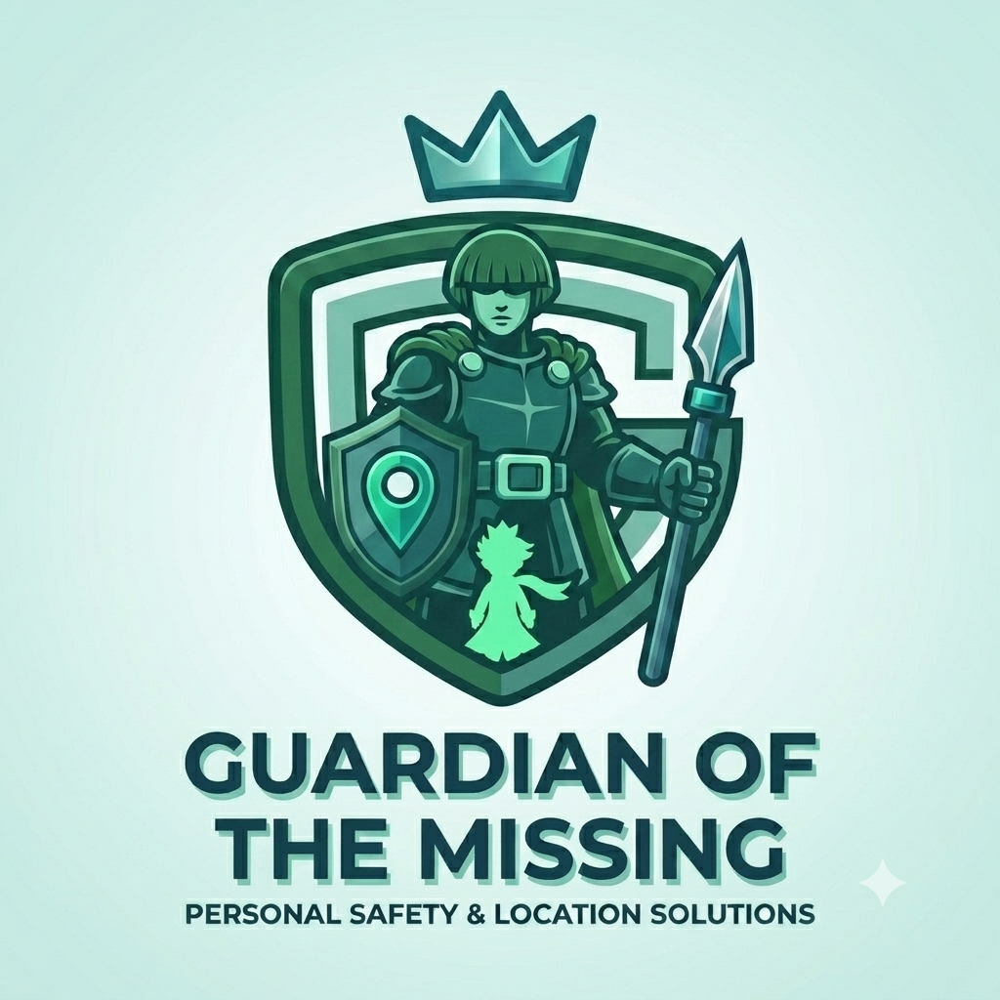
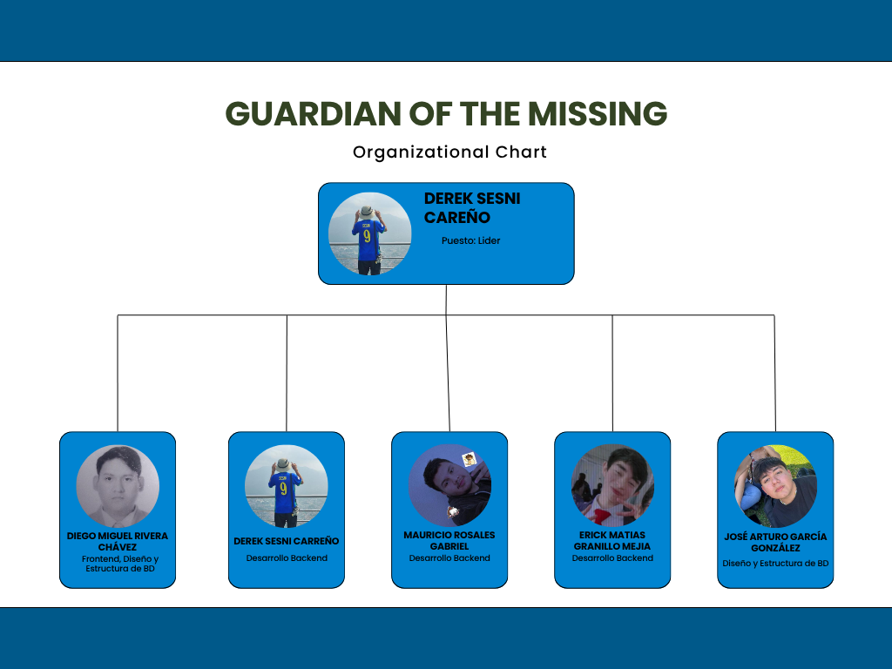
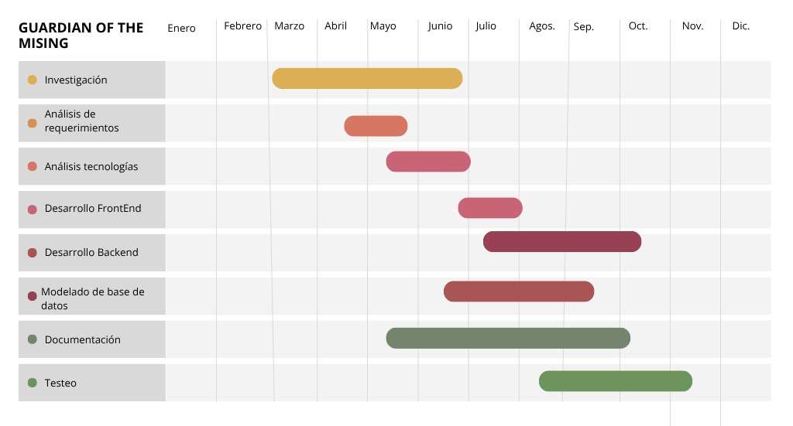

# GuardianOfTheMising
<p align="center">

</p>

El proyecto consiste en el desarrollo de un ecosistema tecnológico orientado a la seguridad personal, integrado por una aplicación móvil para Android, una aplicación para smartwatch con Wear OS y una plataforma web de administración. El sistema permitirá monitorear la ubicación de los usuarios en tiempo real, administrar zonas seguras y de riesgo mediante geocercas, detectar situaciones de emergencia y generar alertas automáticas hacia contactos de confianzaa.

Además, la solución incorporará la captura de evidencia durante una emergencia, incluyendo fotografías, audio, ubicación GPS y la fecha y hora del incidente, permitiendo un mejor seguimiento y respuesta ante situaciones de riesgo.

La plataforma web facilitará la administración de usuarios, la visualización de incidentes en un mapa, el monitoreo de alertas y la consulta del historial de eventos registrados. 

---

# Gestión del Alcance del Proyecto

## Objetivo General

Desarrollar un ecosistema integral de seguridad personal multiplataforma (aplicación móvil, smartwatch y plataforma web) para gestionar la ubicación, prevenir incidentes mediante geocercas y coordinar respuestas inmediatas ante emergencias a través de alertas en tiempo real y la recolección de evidencia.


# Alcance del Proyecto

El proyecto comprende el análisis, diseño, desarrollo, implementación y pruebas de una plataforma de seguridad personal que incluya las siguientes funcionalidades:

- Desarrollo de una aplicación móvil para Android.
- Desarrollo de una aplicación para smartwatch con Wear OS.
- Desarrollo de una plataforma web administrativa.
- Registro e inicio de sesión de usuarios.
- Administración del perfil del usuario.
- Gestión de contactos de emergencia.
- Monitoreo de ubicación en tiempo real mediante GPS.
- Creación y administración de geocercas.
- Detección automática de entrada y salida de zonas seguras o restringidas.
- Botón de pánico para el envío inmediato de alertas.
- Envío de notificaciones en tiempo real.
- Compartición automática de ubicación durante una emergencia.
- Captura de evidencia (fotografía, audio, ubicación y fecha del incidente).
- Historial de alertas y eventos.
- Visualización de incidentes mediante mapas.
- Panel administrativo para la gestión de usuarios.
- Integración entre la aplicación móvil, smartwatch y plataforma web mediante una API REST.
- Almacenamiento seguro de la información.
- Pruebas funcionales, de integración y aceptación.


# Entregables

Al finalizar el proyecto se entregarán los siguientes productos:

1. Documento de análisis de requerimientos.
2. Documento de diseño del sistema.
3. Modelo y base de datos implementada.
4. API REST para la comunicación entre plataformas.
5. Aplicación móvil funcional.
6. Aplicación para smartwatch funcional.
7. Plataforma web administrativa.
8. Sistema de monitoreo mediante GPS.
9. Sistema de geocercas.
10. Sistema de alertas en tiempo real.
11. Sistema de captura y almacenamiento de evidencia.
12. Manual técnico.
13. Manual de usuario.
14. Casos de prueba y resultados.
15. Código fuente documentado.


# Exclusiones del Alcance

El presente proyecto **no contempla**:

- Integración directa con servicios oficiales de emergencia (911, policía o protección civil).
- Desarrollo para dispositivos iOS.
- Reconocimiento facial o autenticación biométrica avanzada.
- Inteligencia Artificial para predicción de incidentes.
- Integración con cámaras de videovigilancia públicas.
- Funcionamiento completamente offline para el envío de alertas.
- Publicación de la aplicación en Google Play Store o App Store.
- Infraestructura propia para alta disponibilidad o balanceo de carga.


# Restricciones

Durante el desarrollo deberán considerarse las siguientes restricciones:

- El sistema dependerá de una conexión a Internet para sincronizar información y enviar alertas.
- La precisión del monitoreo dependerá del GPS del dispositivo móvil.
- Las notificaciones estarán sujetas al funcionamiento de Firebase Cloud Messaging (FCM).
- El desarrollo estará enfocado únicamente en dispositivos Android y Wear OS.
- Se utilizarán herramientas de software libres o con licencia educativa.
- El proyecto deberá concluir dentro del tiempo establecido por la planificación académica.


# Supuestos

Se asume que:

- Los usuarios dispondrán de dispositivos Android compatibles.
- Los smartwatch utilizarán Wear OS.
- Los usuarios concederán permisos para acceder al GPS, cámara, micrófono y almacenamiento.
- Existirá acceso a Internet durante el uso normal del sistema.
- Los servicios de mapas y geolocalización estarán disponibles.
- El servidor permanecerá disponible para recibir y procesar las solicitudes del sistema.

---
# Tecnologías Utilizadas

<p align="center">

<p align="center">


<br>


<br>


<br>


</p>

</p>

El desarrollo del ecosistema de seguridad personal se basa en una arquitectura cliente-servidor, utilizando tecnologías modernas para garantizar escalabilidad, mantenimiento e integración entre las diferentes plataformas.

| Categoría | Tecnología | Descripción |
|-----------|------------|-------------|
| **Frontend Web** | Angular | Desarrollo de la plataforma web administrativa utilizando una arquitectura basada en componentes. |
| **Frontend Móvil** | Android (Kotlin) | Desarrollo de la aplicación móvil para dispositivos Android. |
| **Smartwatch** | Wear OS (Kotlin) | Desarrollo de la aplicación para relojes inteligentes compatibles con Wear OS. |
| **Backend** | Node.js | Entorno de ejecución para el servidor y la lógica del sistema. |
| **Framework Backend** | Express.js | Framework para la creación de la API REST que comunica todas las plataformas. |
| **Base de Datos** | SQL Server | Almacenamiento de usuarios, geocercas, alertas, evidencia e historial del sistema. |
| **ORM / Driver** | mssql | Conexión entre Node.js y SQL Server. |
| **Autenticación** | JSON Web Token (JWT) | Gestión de autenticación y autorización mediante tokens seguros. |
| **Encriptación** | bcrypt | Cifrado de contraseñas antes de almacenarlas en la base de datos. |
| **Mapas y Geolocalización** | Google Maps API | Visualización de mapas, ubicación en tiempo real y administración de geocercas. |
| **Notificaciones Push** | Firebase Cloud Messaging (FCM) | Envío de alertas y notificaciones en tiempo real a dispositivos móviles. |
| **Comunicación** | REST API | Intercambio de información entre la aplicación móvil, smartwatch y plataforma web. |
| **Control de Versiones** | Git | Administración y seguimiento de los cambios del código fuente. |
| **Repositorio** | GitHub | Almacenamiento y colaboración del código del proyecto. |

---

# Arquitectura Tecnológica

```text
                        +----------------------+
                        |   Plataforma Web     |
                        |      Angular         |
                        +----------+-----------+
                                   |
                              REST API (HTTPS)
                                   |
        +--------------------------+--------------------------+
        |                                                     |
+-------+--------+                                   +--------+-------+
| Aplicación     |                                   |   Smartwatch   |
| Android Kotlin |                                   | Wear OS Kotlin |
+-------+--------+                                   +--------+-------+
        |                                                     |
        +--------------------------+--------------------------+
                                   |
                            Node.js + Express
                                   |
                     Autenticación (JWT + bcrypt)
                                   |
                           SQL Server Database
                                   |
        +----------------------------------------------------+
        | Usuarios | Alertas | Geocercas | Evidencias | Logs |
        +----------------------------------------------------+
                                   |
                     Firebase Cloud Messaging
                                   |
                     Notificaciones Push en tiempo real
```
---

# Descripción del Proyecto

## Problemática

Actualmente muchas personas se encuentran expuestas a situaciones de riesgo como desapariciones, robos, violencia o accidentes, sin contar con una herramienta que permita alertar rápidamente a familiares o personas de confianza. Aunque existen aplicaciones de ubicación, pocas integran monitoreo continuo, geocercas, evidencia del incidente y múltiples plataformas de administración.

**GuardianOfTheMissing** surge como una solución tecnológica que busca reducir el tiempo de respuesta durante una emergencia mediante el monitoreo en tiempo real y el envío inmediato de alertas.

## Solución Propuesta

GuardianOfTheMissing es un ecosistema compuesto por:

- Aplicación Android.
- Aplicación para Wear OS.
- Plataforma Web Administrativa.
- API REST.

El sistema permite:

- Monitorear la ubicación del usuario en tiempo real.
- Detectar el ingreso y salida de zonas seguras mediante geocercas.
- Enviar alertas mediante un botón de pánico.
- Compartir la ubicación con contactos de emergencia.
- Capturar evidencia (fotografías, audio, GPS y fecha del incidente).
- Administrar usuarios e incidentes desde una plataforma web.

---

# Documentación

La documentación del proyecto se encuentra organizada para facilitar el mantenimiento y evolución del sistema.

## Documentos disponibles

- Documento de Análisis de Requerimientos Funcionales y No Funcionales.
- Reglas de Negocio(BR)
- Casos de Uso.
- Diagramas UML.
- Modelo Entidad-Relación.
- Diseño de Base de Datos.
- Arquitectura del Sistema.
- Documentación de la API REST.
- Manual Técnico.
- Manual de Usuario.
- Casos de Prueba.

---

# Estructura del Proyecto

```text
GuardianOfTheMissing
│
├── backend
│   ├── controllers
│   ├── models
│   ├── routes
│   ├── middlewares
│   ├── services
│   ├── config
│   └── app.js
│
├── frontend-web
│   ├── src
│   ├── assets
│   ├── components
│   ├── services
│   └── environments
│
├── mobile-app
│   ├── activities
│   ├── fragments
│   ├── services
│   ├── models
│   └── utils
│
├── smartwatch
│   ├── activities
│   ├── services
│   └── models
│
├── database
│   ├── scripts
│   ├── procedures
│   └── backups
│
├── documentation
│
└── README.md
```

---

# Gestión de Recursos Humanos

El desarrollo del proyecto se llevará a cabo mediante un equipo multidisciplinario, donde cada integrante tendrá responsabilidades específicas para garantizar el cumplimiento de los objetivos establecidos.

## Roles del Proyecto

| Integrante                   | Matrícula | Rol en el Equipo                     | Contacto                                                   |
|------------------------------|------------|--------------------------------------|-----------------------------------------------------------|
| Derek Sesni Carreño          | `230892`   | Lider, Desarrollo Backend           | [@DevFntxy](https://github.com/DevFntxy)                   |
| Diego Miguel Rivera Chavez   | `230260`   | Frontend, Diseño y Estructura de BD | [@DiegoMiguel04](https://github.com/DiegoMiguel04)         |
| José Arturo Garcia Gonzalez  | `230629`   | Diseño y Estructura de BD           | [@ppyo1234](https://github.com/ppyo1234)                   |
| Mauricio Rosales Gabriel     | `220859`   | Desarrollo Backend                  | [@elmau0834x](https://github.com/elmau0834x)               |
| Erick Matias Granillo Mejia  | `230045`   | Desarrollo Backend                  | [@EMATIAS](https://github.com/EMATIAS230045)               |

---

# Organigrama
<p align="center">

</p>

---

## Metodología de Trabajo

El proyecto seguirá la metodología ágil **Scrum**, organizando el desarrollo en Sprints que contemplan:

- Planeación.
- Desarrollo.
- Integración.
- Pruebas.
- Revisión.
- Retrospectiva.

---
# Diagrama de Gant

<p align="center">

</p>

---

# Gestión de Interesados

Los principales interesados del proyecto son las personas u organizaciones que participan o se benefician del desarrollo del sistema.

| Interesado | Participación |
|------------|--------------|
| Usuarios Finales | Utilizar el sistema para su seguridad personal. |
| Equipo de Desarrollo | Diseño, implementación y mantenimiento del sistema. |
| Docente | Supervisión y evaluación del proyecto académico. |
| Administrador del Sistema | Administración de usuarios e incidentes registrados. |
| Contactos de Emergencia | Recepción de alertas y seguimiento de emergencias. |

---

# Gestión del Tiempo

El desarrollo del proyecto se organiza en distintas fases para asegurar una correcta planificación y cumplimiento de los objetivos.

| Fase | Duración Estimada |
|-------|-------------------|
| Planeación | 2 semanas |
| Análisis | 2 semanas |
| Diseño | 2 semanas |
| Desarrollo Backend | 4 semanas |
| Desarrollo Web | 4 semanas |
| Desarrollo Android | 5 semanas |
| Desarrollo Wear OS | 3 semanas |
| Integración | 2 semanas |
| Pruebas | 2 semanas |
| Documentación | 2 semanas |

---

# Gestión de Costos

Al tratarse de un proyecto académico, se prioriza el uso de tecnologías gratuitas, de código abierto o con licencia educativa para minimizar los costos de implementación.

## Recursos Tecnológicos

| Recurso | Tipo |
|----------|------|
| Android Studio | Gratuito |
| Visual Studio Code | Gratuito |
| Node.js | Open Source |
| Angular | Open Source |
| SQL Server Developer | Gratuito |
| Firebase | Plan Gratuito |
| GitHub | Gratuito |
| Google Maps API | Cuota gratuita disponible |

---

# Gestión de Adquisiciones

El proyecto requiere el uso de herramientas y servicios proporcionados por terceros.

| Servicio | Proveedor |
|-----------|-----------|
| Firebase Cloud Messaging | Google |
| Google Maps API | Google |
| GitHub | GitHub |
| SQL Server Developer | Microsoft |
| Android Studio | Google |

No se contempla la adquisición de infraestructura física ni hardware especializado.

---

# Gestión de la Comunicación

La comunicación entre los integrantes del proyecto se realizará utilizando herramientas colaborativas que faciliten el seguimiento de actividades y el intercambio de información.

## Medios de Comunicación

- Microsoft Teams.
- WhatsApp.
- GitHub.
- Jira
- Reuniones semanales.
- Revisión de avances por Sprint.

La comunicación entre la aplicación móvil, smartwatch y plataforma web se realizará mediante una **API REST** utilizando el protocolo **HTTPS**.

---

# Gestión de la Calidad

Para asegurar la calidad del software se implementarán diferentes estrategias durante todo el ciclo de desarrollo.

## Actividades de Calidad

- Pruebas Unitarias.
- Pruebas Funcionales.
- Pruebas de Integración.
- Pruebas de Aceptación.
- Revisión de Código.
- Control de Versiones mediante Git.
- Validación de Requerimientos.
- Documentación Continua.

## Criterios de Calidad

- Seguridad en la autenticación.
- Correcto funcionamiento del GPS.
- Integridad de la información.
- Disponibilidad del sistema.
- Buen tiempo de respuesta.
- Facilidad de uso.
- Escalabilidad de la arquitectura.

---

# Gestión de Riesgos

Durante el desarrollo pueden presentarse riesgos que afecten el cumplimiento de los objetivos del proyecto. Para minimizar su impacto se definen las siguientes estrategias.

| Riesgo | Impacto | Plan de Mitigación |
|---------|----------|--------------------|
| Fallo del GPS | Alto | Validar la precisión de la ubicación antes de enviar alertas. |
| Falta de conexión a Internet | Alto | Reintentar el envío de información cuando se restablezca la conexión. |
| Fallo del servidor | Alto | Implementar respaldos periódicos y monitoreo continuo. |
| Cambios en los requerimientos | Medio | Gestionar los cambios mediante Scrum y control de versiones. |
| Pérdida de información | Alto | Realizar respaldos automáticos de la base de datos. |
| Fallos en servicios externos (Firebase, Google Maps) | Medio | Implementar manejo de errores y mecanismos de recuperación. |
| Retrasos en el desarrollo | Medio | Seguimiento continuo mediante Sprints y reuniones periódicas. |